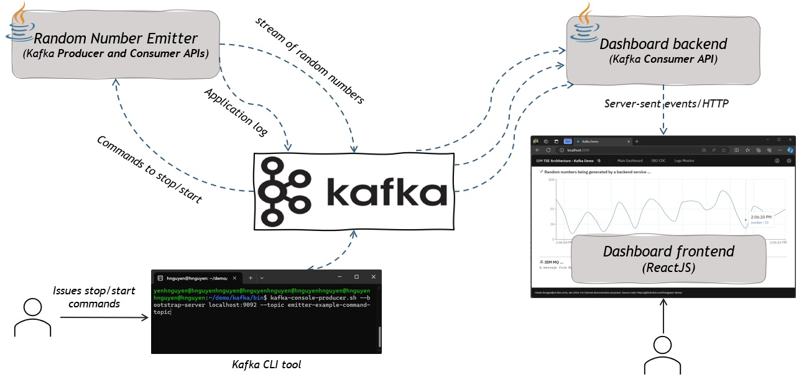

# An example of real-time Dashboard with Kafka, Java and ReactJS

## Scope

This project should be used for learning or demonstration purposes

## Usage 

####  Overview

The repository contains an example of an application which generates and publishes random numbers to Kafka. And then read those numbers from Kafka and display them via as a web-based dashboard. 

The example includes three components: the random number emitter service, the dashboard backend, and the dashboard frontend. The fronend is a ReactJS-based web application, it doesn't communicate with Kafka directly, instead it will receive data via the dashboard backend using Server-Sent Events (SSE). The random number emitter service is written in Java using Kafka Clients API directly. While the other dashboard backend is based on Spring framework, and uses the spring-kafka library.

#### Prerequisites

- Kafka (for how to setup and run Kafka, refer to https://kafka.apache.org/quickstart)
- Node.js
- JDK 1.8 or later

#### How to run

1 Start Kafka if not yet

2 Start dashboard-app/backend

~~~
$ cd dashboard-app/backend
$ mvnw spring-boot:run

The default port is 8080
~~~

3 Start dashboard-app/frontend

~~~
$ cd dashboard-app/frontend
$ npm install   # once time only
$ npm start

Open web browser and try http://localhost:3000
~~~

4 Start the backend service random-number-emitter

~~~
$ cd random-number-emitter
$ mvnw clean compile exec:java

# Go to the step 5, issue a Start request via Kafka to start emitting. Also Cltr-C to terminate the program
~~~

5 Issue a Start command to request random-number-emitter to start emitting random numbers via Kafka by using Kafka CLI

~~~
$ <Your Kafka install dir>/bin/kafka-console-producer.sh --bootstrap-server localhost:9092 --topic number-emitter-admin-topic
# Try entering the value 'start' or 'stop' to control random-number-emitter
 ~~~

## Note

This is an example used for demonstration purposes. Therefore in some cases, the design/implementation may be simple or naive; some concerns such as security, unit testing, error handling, logging,... and good/best practices may be ignored

## License

Apache-2.0 

You may obtain a copy of the License at

    http://www.apache.org/licenses/LICENSE-2.0
